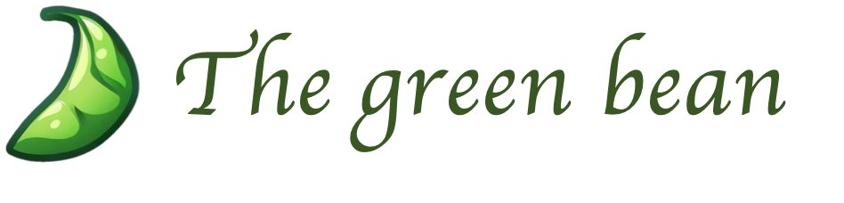

# The Green Bean



## Short introduction

We help businesses comply with sustainability regulations in different parts of the world. We do this by helping businesses understand sustainability regulations and keep up with latest trends and news in the space in a low cost and hyperpersonalised way.

## Long introduction

_Problem_ : When small/medium sized businesses want to expand to a new market. they need to comply with local sustainability regulations. They turn to expensive consulting firms to get personalised compliance advice and reports, something which can be a barrier for many due to lack of capital.

We present a low cost AI solution, affectionately called "The green bean", that aims to provide intelligent and useful information on how the sustainability regulations impact your specific business. We aim to do this in 3 key steps: a) helping understand current regulations, b) keeping up to date with latest sustainability news relevant to your business, and c) generating marketing content for communication of efforts with stakeholders. (Part c is future work)

We use autonomous agents to build a corpus of regulatory documents for USA, India and Singapore. We allow the user interested in venturing into these markets to explore news, as well as ask narrow and specific questions over our corpus, tailored for their business. This is all done through a polished web interface.

In this hackathon, we thus present a MVP for what such a platform would look like, already covering major functionality in of idea. We host our project online for anyone to interact with. [note: the backend uses my personal API keys, and free tiers for some services, so I seek your kind understanding if the app acts a little slow/times out when you visit it]

Policy design, regulation, as well as implementation into the real world are key components of our goal of a more sustainable future. By helping businesses better implement and understand policy into their daily operations, we can take a small but critical step towards a greener future.

## Running instructions

### frontend

```bash
cd frontend/
yarn install # install npm packages
yarn dev # start dev server
```

### backend

Create a `.env` file in the `backend` folder.

```dotenv
## llm key
OPENAI_API_KEY=xxx

## vector db
PINECONE_ENV=xxx
PINECONE_API_KEY=xxx

## tools
SERP_API_KEY=xxx
BROWSERLESS_API_KEY=xxx
```

To run the server,

```bash
cd backend
# create new env
conda create --name hackathon
conda activate hackathon
# install deps
pip install -r requirements.txt
uvicorn api:app --host 0.0.0.0 --port 6969
```
